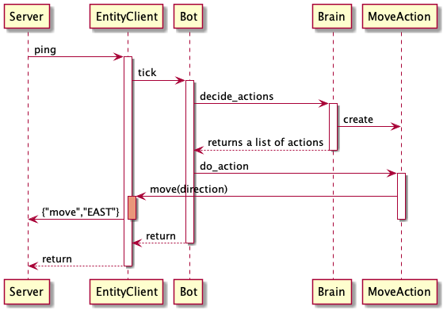

[](https://travis.ibm.com/DevCamp/kaverns-and-kubernetes-bot-advanced)

# Kaverns and Kubernetes Bot (advanced) (K&K Bot +)

A python implementation of a 'Bot' which interacts with the K&K dungeon crawler


## Code Documentation
The code documentation has been rendered to [github pages](https://pages.github.ibm.com/DevCamp/kaverns-and-kubernetes-bot-advanced/)

## Pre-reqs
To develop this code, you need to install some software:

- Pyenv
  - This controls which version of python available in a shell
  - It supports installing many versions of python at once
  - You can switch between python versions easily
  - https://realpython.com/intro-to-pyenv/
  
- Python 
  - Once you have pyenv installed, use it to install Python `3.8.0`
  - eg: `pyenv install 3.8.0`  and `pyenv global 3.8.0`


## Setup
invoke the `./setup.sh` script from the top level project folder.

## Running the program (locally)
use the `./run.sh` script from the top level project folder.

This causes `__main__.py` to be called in the roguebot package.

## Supported environment variables

<dl>


<dt>K_AND_K_BOT_DEBUG</dt>
<dd>Do you want to have debug information logged ? `True` or `False`

For example:
```script
export K_AND_K_BOT_DEBUG="True"
```
</dd>


<dt>K_AND_K_BOT_NAME</dt>
<dd>Sets the name by which the bot will be known by other bots

For example:
```script
export K_AND_K_BOT_NAME="fred"
```
</dd>


<dt>K_AND_K_BOT_ROLE</dt>
<dd>The character class of the bot.

For example:
```script
export K_AND_K_BOT_ROLE="warrior"
```
</dd>


<dt>K_AND_K_BOT_SPEED</dt>
<dd>The speed of the bot. Controls how many ticks does it ignore 
before thinking of a move to make. 1-10. 10 is the fastest. 1 the slowest. 
Optional. Defaults to 5.

Useful if you want to follow the bot to see what it does,
or slow it down.

For example:
```script
export K_AND_K_BOT_SPEED="3"
```
</dd>

<dt>K_AND_K_BOT_ACTIONS_PER_TURN</dt>
<dd>The number of move actions the bot attempts to use each turn.
This can have the effect of speeding up movement by taking the next *n*
moves along ga planned path, rather than just the first one.
Default is 1.

For example:
```script
export K_AND_K_BOT_ACTIONS_PER_TURN="1"
</dd>


<dt>K_AND_K_BOT_HTTP_SERVER_PORT and K_AND_K_BOT_HTTP_SERVER_ADDRESS</dt>
<dd>Which port should the bot bind its' own small HTTP server up to ?
ie: The address and port that the bots' HTTP server listens to for 
in-coming requests.

Kubernetes can inquire about the bots' health using these services
with an aliveness and readiness probe.

If the port is not set, then no HTTP server is started by the bot.

For example:
```script
export K_AND_K_BOT_HTTP_SERVER_PORT=4001
export K_AND_K_BOT_HTTP_SERVER_ADDRESS=127.0.0.1
```
</dd>

<dt>K_AND_K_BOT_STARTUP_DELAY_SECONDS</dt>
<dd>The number of seconds the bot waits between starting up it's own 
http server, and when it starts playing.

This allows kubernetes to see an 'ALIVE' state for this amount of 
time before the bot goes 'READY'

Defaults to 0 seconds.

For example:
```script
export K_AND_K_BOT_STARTUP_DELAY_SECONDS=10
```
</dd>

<dt>K_AND_K_SERVER_URL</dt>
<dd>The K&K server is where ?

For example:
```script
export K_AND_K_SERVER_URL="http://localhost:3000"
```
</dd>

</dl>


## Calling unit tests locally
Use the `./test.sh` script to run unit tests and show code coverage.

## To generate the documentation locally
You can render the documentation to html locally, using `./build-docs.sh`

This generates html files which can be opened in a browser. For example: `open ./docs/_build/html/index.html`

## While developing
Run `sniffer` to continually call unit tests whenever anything changes.

Note: The [travis build](https://travis.ibm.com/DevCamp/kaverns-and-kubernetes-bot) 
(and the ./test.sh script) uses pylint to do static analysis of the code.
If the code style differs wildly from `pep8` standard, the conformance score will drop, and the build will fail !

## Feature list
- Communications:
  - Connects to the server on a host and port set by environment variables (see above)
  - If the server isn't there, the client gives up immediately
  - If the server drops mid-game, the client re-tries for about 20 seconds then gives up and exits
  - If the bot dies, it closes down the connection and exits the program
- Map:
  - If the server sends a map, the bot remembers it to use for navigation
- Entities:
  - The server sends a list of entities (the bot is an entity), which the bot keeps track of
  - Each entity has an ID
  - Updates to entities over-write existing memory of those entities
  - When other bots/monsters move, updates arrive from the server
  - Understands and tracks it's own location on the map
- Brain:
  - Keeps a stack of goals, and lets the top-most goal decide what to do next, 
    once every n 'ping' commands sent from the server
  - Explorer goal decides a direction to move at random
    - Avoids walking into walls or other entities
    - Can walk up and down stairs
    - Tries to move to areas it's not been before, to explore the entire dungeon eventually
- Code coverage generated by all testing, usable by VSCode plugin
- In-build personal HTTP server to respond to Kubernetes aliveness and readiness probes

## To set up code coverage display in VSCode
Install [VSCode Coverage Gutter Plugin](https://marketplace.visualstudio.com/items?itemName=ryanluker.vscode-coverage-gutters)

The default settings should pick up the cov.xml which either the `./test.sh` or `sniffer` will generate.

Go and edit a python module. While in the editor, use the Shift-Cmd-7 key to toggle-on red/green coverage results visually.
Use shift-cmd-0 to turn off the coverage gutters again.

### How does the code coverage setup work ?
It works by calling `pytest` via the `coverage` tool.
The `coverage` tool uses information inside the `setup.cfg` to decide what to gather coverage stats on.
It then creates a data file during the execution `.coverage` (not checked-in to `git`)
This file can be used by `coverage report` to give a textual summary of overall coverage in a table.
The `.coverage` file can be converted to a `cov.xml` file, which tools like the `Gutter plugin` can use to highlight lines green/yellow/red.

## The Bot lifecycle
The Bot starts by spawning a second thread, in which a personal HTTP
server is started, binding to a port as specified by the 
`K_AND_K_BOT_HTTP_SERVER_PORT` and `K_AND_K_BOT_HTTP_SERVER_ADDRESS`
environment variables.

Immediately after the HTTP server is active, the Bot will be in `ALIVE`
state.

The bot then waits for `K_AND_K_BOT_STARTUP_DELAY_SECONDS` seconds.

Then the bot starts to play.

As soon as the Bot has a connection with the server, it has an entity
ID assigned, and has an `Entity` object in the `State`. At this point 
the Bot enters the `READY` state.

These states can be observed by issueing HTTP `GET` commands against the 
Bots' personal HTTP server. 

This is exactly what Kubernetes will do to get the state of the Pod running
the Bot.

Use the `GET .../` variant for the liveness probe.

use the `GET .../ready` variant for the readiness probe.


## REST api

The Bot starts an HTTP server so that it can respond to Kubernetes 
Liveness probe and Readiness probe.

See [here](https://k21academy.com/docker-kubernetes/kubernetes-readiness-and-livenessprobe/)
for an explanation of these probes and why they are needed.

### GET http://host:port/
If the Bot's personal HTTP server is active, then it returns `(200) OK`
```json
{ "state" : "ALIVE" }
```

If the Bot is playing on the K&K server, then it returns `(200) OK`
```json
{"status": "READY" }
```

### GET http://host:port/ready
This HTTP resource is suitable for use with the Kubernetes readiness probe.

If the Bot's personal HTTP server is active, then it returns `(503) Service Unavailable`
```json
{ "state" : "ALIVE" }
```

If the Bot is playing on the K&K server, then it returns `(200) OK`
```json
{"status": "READY" }
```

### GET http://host:port/status
If the Bot's personal HTTP server is active, then it returns
```json
{ "state" : "ALIVE" }
```

If the Bot is playing on the K&K server, then it returns
```json
{"status": "READY", "name": "fred", "hp": 10, "ac": 10 , "...etc" :  "...etc }
```
ie: It returns far more about the state of the bot.

## UML

### The overall structure of the code


### The Action class hierarchy


### Re-build the UML diagrams
The UML diagrams are generated from text files using `PlantUML` tooling.

To re-build, use this command:
```
./build-uml.sh
```

## How is the state updated ?
The `Bot` has the ability to move around the dungeon. Currently this is a pretty random affair, with the 
brain effectively choosing which neighbouring `Point` it wants to move to, and adding a `MoveAction` into the 
list of actions returned to the `Bot`.

The `MoveAction.do_action` method gets called by the `Bot` to enact the action.
The `MoveAction` then calls the client, to `send_move` to the server.



When the server moves the entity, it sends out a `position` event to all connected clients.
The clients are then responsible for updating their *state* to match the servers' view of the world.

For example:


So you can see how each entity knows where it is located.

A similar situation is true for items, in that the `Items` object knows where each item is.

## Useful/Fun/Interesting Python references
- General python and libraries
  -  (pep8 - code formatting)[https://pep8.org/]
  -  (asyncio)[https://realpython.com/async-io-python/]
  -  (socketio)[https://python-socketio.readthedocs.io/en/latest/client.html]
  -  (Python docker image)[https://hub.docker.com/_/python/]
  -  (Travis building python)[https://docs.travis-ci.com/user/languages/python/]
  -  (Logging library)[https://docs.python.org/3/howto/logging.html]
  -  (The special id() python method)[https://www.w3schools.com/python/ref_func_id.asp]
- Unit testing
  - (Mocks)[https://realpython.com/python-mock-library/]
  - (Assertpy - fluent assert_this library)[https://github.com/assertpy/assertpy]
  - (Coverage - measuring code coverage)[https://coverage.readthedocs.io/en/coverage-5.5/]
  - (Pylint - static code analysis)[https://pylint.org/]
  - (Pytest Fixtures - injecting objects into tests)[https://docs.pytest.org/en/latest/how-to/fixtures.html]
- Path finding
  - (A* and other path finding algorithms)[https://www.redblobgames.com/pathfinding/a-star/introduction.html]
  - (JPS+ path finding algorithm)[https://learning.oreilly.com/library/view/game-ai-pro/9781482254792/K23980_C014.xhtml#_idParaDest-206]
  